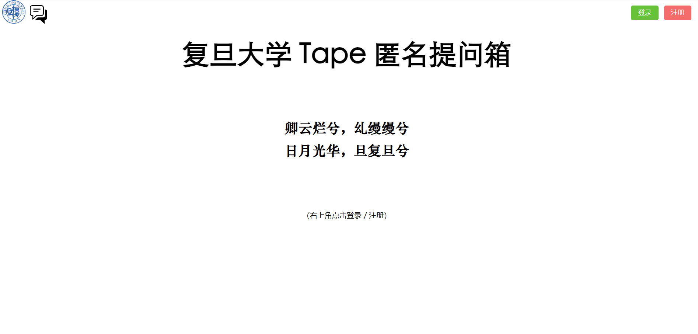

# freesay

Freesay is where you can chat and share freely. 

> lhc：https://github.com/lkdhy
>
> wsh：https://github.com/formula12

## [TODO]下一步计划

- [x] ~~0505周日晚 21:35 （已删除）~~

- [ ] ==0514周二晚==

  > （Ctrl+，）去往 [./数据库设计与前后端交互接口说明.md](./数据库设计与前后端交互接口说明.md)
  >
  > 或：Typora 左边导航栏中点击打开
  
  > 完成了可以前面打✔
  
  - [ ] 【TODO】Django + Mysql 完整创建三张数据库表
  - [ ] 【TODO】逐一说明各个接口的意义，并进行后端实现

## 本项目目录结构

* 前端（基于 Vue）：`frontend` 目录
* 后端（基于 Django）：`backend` 目录
* 一些学习实践的记录：
  * `Vue 学习.md`
  * `django 学习.md`
* 助教 Vue 讲座文件：`env_H班Vue讲解.md`
* 本文件：`README.md`
* 其它：测试、草稿等文件

## 环境配置

### 前端

​	已删

### 后端

​	已删

### 登录过程（前后端交互）

在前端的登录界面：打开开发者界面，看 “调试控制台”、“网络“ 等

​	已删

---

## 功能与创新性

freesay 将被设计成一个基于提问箱的社交网站，支持 “公有墙” 与每个人的 “私有墙”。

### 概述

- 注册登录

  用户需要注册账号，登录使用

- 创建提问箱
  - 用户可编辑提问箱主题，生成提问箱链接分享到广场或朋友圈
  - 同时，可以选择一些 *tag*，表示目前希望收到这些类别的问题
  
- 发布提问帖
  - 由分享的链接或在用户主页进入他的提问箱，发布提问帖，可设置帖子为公开还是私密，以及自己匿名还是实名
  - 标记上问题的 *tag*
  
- 回复帖子
  - 箱子主人回复帖子，并可选择将此回复变为公开或私密
  - 支持 *thread*，即提问者和被提问者持续进行互动
  
- 每日 “表白墙”
  - 一个 “公有墙”，每天刷新，内容均公开，但可选择匿名还是实名
  - 支持 *thread*
  
- “个人墙” 的分类搜索

  浏览用户的 “个人墙“ 时，选择某一 *tag* 筛选相关问答贴

- 私信聊天
  
  与好友一对一聊天

### 创新性

#### 提问时的常见问题推荐

在提问界面，提供一些常见问题，可给提问者带来便利和 “灵感”。

> 假期做什么来打发时间？
> 喜欢看什么样的电影？
> 你现在是单身吗？

#### 标签及相关功能

* [*free*]
* [学习]、[恋爱]、[生活]、[二次元] ……

##### 提问箱附带标签

发提问箱的人愿意和他人交流，但其未必乐意看到所有类型的问题，因而最终可能为避免某些尴尬而不发提问箱。

所以考虑给发提问箱的用户提供选择一些 tag 的功能，表示目前希望收到这些类别的问题。

##### “个人墙” 的分类搜索

为用户通过个人墙了解他人的需求提供便利。
